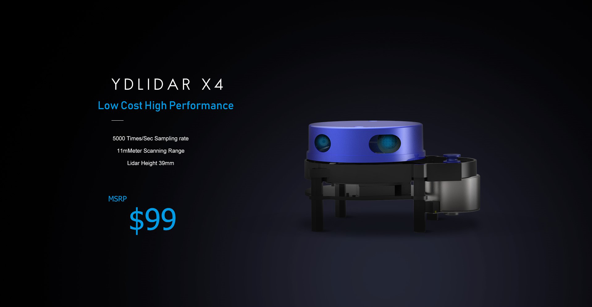
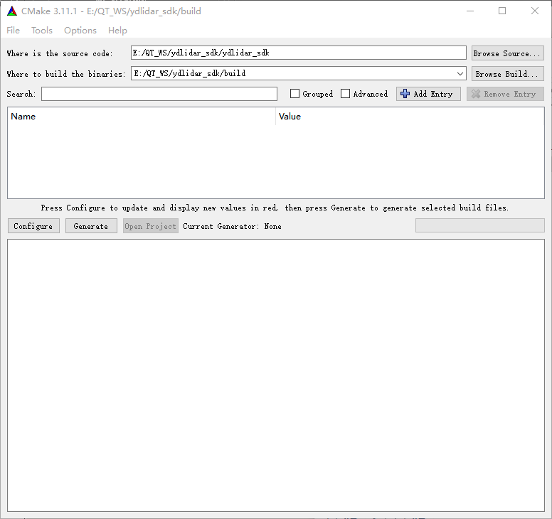
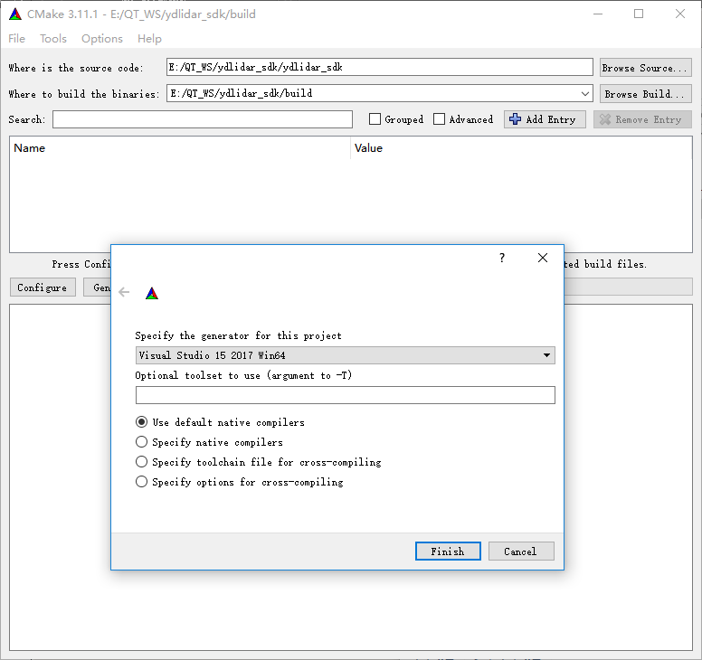
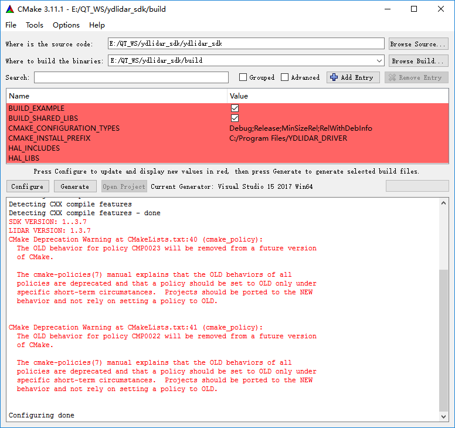
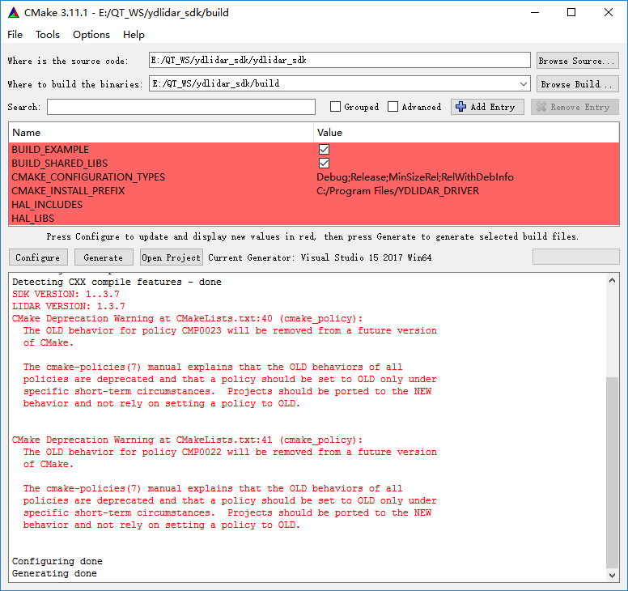
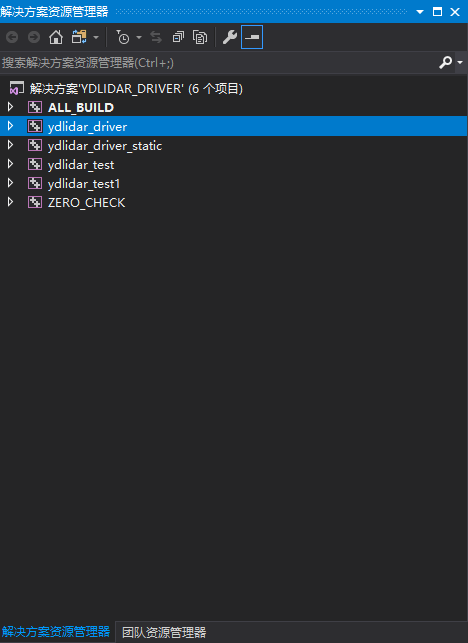
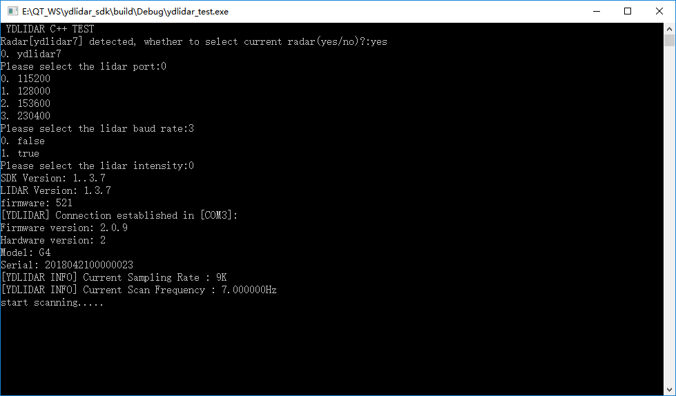
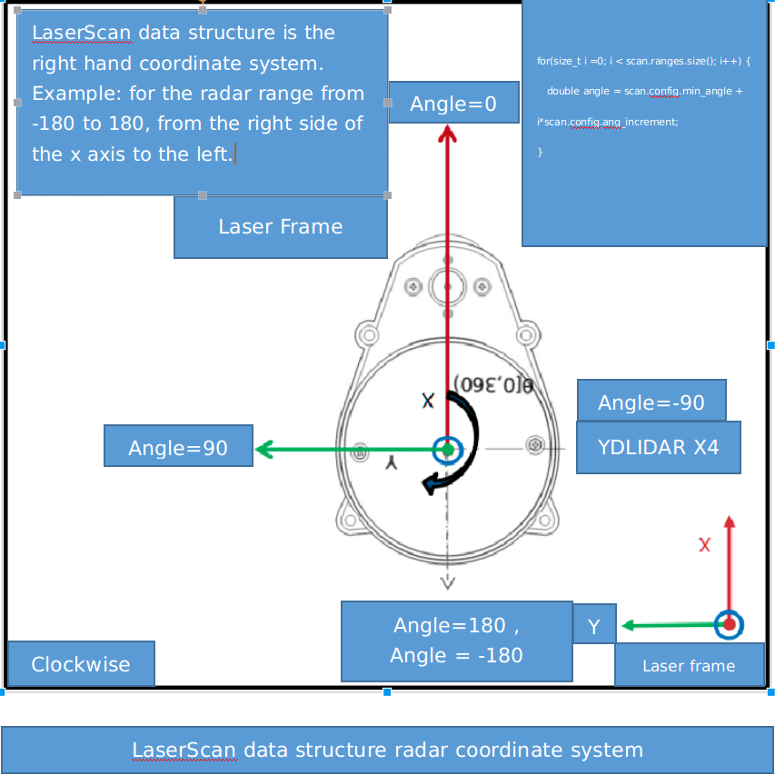

YDLIDAR SDK [](https://travis-ci.org/cansik/ydlidar_sdk) [](https://ci.appveyor.com/project/cansik/ydlidar_sdk) [](https://codebeat.co/projects/github-com-cansik-ydlidar_sdk-master)
=====================================================================


Introduction
-------------------------------------------------------------------------------------------------------------------------------------------------------

YDLIDAR(https://www.ydlidar.com/) series is a set of high-performance and low-cost LIDAR sensors, which is the perfect sensor of 2D SLAM, 3D reconstruction, multi-touch, and safety applications.

If you are using ROS (Robot Operating System), please use our open-source [ROS Driver]( https://github.com/yangfuyuan/ydlidar_ros) .

Release Notes
-------------------------------------------------------------------------------------------------------------------------------------------------------
| Title      |  Version |  Data |
| :-------- | --------:|  :--: |
| SDK     |  1.3.7 |   2018-8-14  |


- [new feature] support mutil-lidar binding port.
- [new feature] support ini format configuration paramters.
- [new feature] Get online Lidar list.
- [Optimization] Simplified interface.


Dataset 
-------------------------------------------------------------------------------------------------------------------------------------------------------

Support LIDAR Model(Only S4Pro support intensity)


| Model      |  Baudrate |  Sampling Frequency | Range(m)  | Scanning Frequency(HZ) | Working temperature(°C) | Laser power max(mW) | voltage(V) | Current(mA)
| :-------- | --------:|--------:|  --------:| --------:|--------:| --------:| --------:|  :--: |
| G4     |  230400 |   9000  |  0.26-16   |5-12|0-50| ~5|4.8-5.2|400-480|
| X4     |  128000 |   5000  |  0.12-10   |5-12|0-40| ~5|4.8-5.2|330-380|
| F4     | 115200 |   4000 |  0.1-12        |5-12|0-40| ~5|4.8-5.2|400-480|
| S4     |  115200|    4000 |  0.1-8        |6-12|0-40| ~5|4.8-5.2|330-380|
| S4Pro |  153600|    4000 |  0.1-8        |6-12|0-40| ~5|4.8-5.2|330-380|

How to build YDLIDAR SDK samples
-------------------------------------------------------------------------------------------------------------------------------------------------------

    $ git clone https://github.com/yangfuyuan/ydlidar_sdk

    $ cd ydlidar_sdk

    $ git checkout master

    $ cd ..
    
Linux:

    $ mkdir build

    $ cd build

    $ cmake ../ydlidar_sdk   ##windows: cmake -G "Visual Studio 14 2017 Win64" ../ydlidar_sdk 

    $ make


Windows:

1. install [cmake](https://cmake.org/download/)(if there is no cmake)


2. build steps:


Step1: open cmake-gui and select source code/binaries directory





Step2: Configure and select build toolchain(choose the VS version in your system)


  


Step3: configuring done(click "Configure" button)  





Step4: generating  done(click "Generate" button)  





Step5: open vs Project in binaries directory





Step6: build finished and run test:


 


3. Compile wth Qt:
1). Qt configuration cmake
2). Open the CmakeLists.txt project file with Qt.
	
	
	
	
How to run YDLIDAR SDK samples
-------------------------------------------------------------------------------------------------------------------------------------------------------

linux:

    $ ./ydlidar_test

      YDLIDAR C++ TEST

       Radar[ydlidar7] detected, whether to select current radar(yes/no)?:yes

       0. ydlidar7

    $ Please select the lidar port:0

      0. 115200

      1. 128000

      2. 153600

      3. 230400

    $ Please select the lidar baud rate:3

      0. false

      1. true

    $ Please select the lidar intensity:0


windows:

    $ ydlidar_test.exe

      YDLIDAR C++ TEST

       Radar[ydlidar7] detected, whether to select current radar(yes/no)?:yes

       0. ydlidar7

    $ Please select the lidar port:0

      0. 115200

      1. 128000

      2. 153600

      3. 230400

    $ Please select the lidar baud rate:3

      0. false

      1. true

    $ Please select the lidar intensity:0
    
    
Console Display:

You should see YDLIDAR's scan result in the console:

  	YDLIDAR C++ TEST

  	Radar[ydlidar7] detected, whether to select current radar(yes/no)?:yes

  	0. ydlidar7

  	Please select the lidar port:0

  	0. 115200

  	1. 128000

  	2. 153600

  	3. 230400

  	Please select the lidar baud rate:3

  	0. false

  	1. true

  	Please select the lidar intensity:0

  	SDK Version: 1..3.7

  	LIDAR Version: 1.3.7

  	fhs_lock: creating lockfile:      18341

  	firmware: 521

  	[YDLIDAR] Connection established in [/dev/ttyUSB0]:

  	Firmware version: 2.0.9

  	Hardware version: 2

  	Model: G4

  	Serial: 2018042100000023

  	[YDLIDAR INFO] Current Sampling Rate : 9K

  	[YDLIDAR INFO] Current Scan Frequency : 7.000000Hz

  	received scan size: 1039

  	scan   system time: 1534400129245291000

  	scan     self time: 1534400129103710800

  	scan     frequency: 8.67053HZ

  	received scan size: 1231

  	scan   system time: 1534400129379541000

  	scan     self time: 1534400129232496800

  	scan     frequency: 7.31708HZ

  	received scan size: 1272

  	scan   system time: 1534400129530262000

  	scan     self time: 1534400129378863800

  	scan     frequency: 7.08105HZ

  	received scan size: 1295

  	scan   system time: 1534400129671749000

  	scan     self time: 1534400129519748800

  	scan     frequency: 6.95518HZ

  	^Csignal_handler(2)

  	received scan size: 1341

  	scan   system time: 1534400129839365000

  	scan     self time: 1534400129671106800

  	scan     frequency: 6.71642HZ

  	fhs_unlock: Removing LockFile


Note: If you have already run the program once. change the configuration parameters through the "lidar.ini" file.

Data structure
-------------------------------------------------------------------------------------------------------------------------------------------------------

data structure:

    //! A struct for returning configuration from the YDLIDAR
    struct LaserConfig {

        //! Start angle for the laser scan [rad].  0 is forward and angles are measured clockwise when viewing YDLIDAR from the top.
        float min_angle;

        //! Stop angle for the laser scan [rad].   0 is forward and angles are measured clockwise when viewing YDLIDAR from the top.
        float max_angle;

        //! Scan resolution [rad].
        float ang_increment;

        //! Scan resoltuion [ns]
        float time_increment;

        //! Time between scans
        float scan_time;

        //! Minimum range [m]
        float min_range;

        //! Maximum range [m]
        float max_range;

        //! Range Resolution [m]
        float range_res;

      };


      struct LaserScan {

        //! Array of ranges
        std::vector<float> ranges;

        //! Array of intensities
        std::vector<float> intensities;

        //! Self reported time stamp in nanoseconds
        uint64_t self_time_stamp;

        //! System time when first range was measured in nanoseconds
        uint64_t system_time_stamp;

        //! Configuration of scan
        LaserConfig config;

      };

example angle parsing:

    for(size_t i =0; i < scan.ranges.size(); i++) {

      // current angle
      double angle = scan.config.min_angle + i*scan.config.ang_increment;// radian format

      //current distance
      double distance = scan.ranges[i];//meters

      //current intensity
      int intensity = scan.intensities[i];

    }

laser callback function code :

      void LaserScanCallback(const LaserScan& scan) {

          std::cout<< "received scan size: "<< scan.ranges.size()<<std::endl;

    	  std::cout<< "scan   system time: "<< scan.system_time_stamp<<std::endl;

    	  std::cout<< "scan     self time: "<< scan.self_time_stamp<<std::endl;

    	  std::cout<< "scan     frequency: "<< 1000000000.0/scan.config.scan_time << "HZ"<<std::endl;

          for(size_t i =0; i < scan.ranges.size(); i++) {

            // current angle
            double angle = scan.config.min_angle + i*scan.config.ang_increment;// radian format

            //current distance
            double distance = scan.ranges[i];//meters

            //current intensity
            int intensity = scan.intensities[i];

          }

        }
        

Quick Start
-----------

The best way to learn how to use sdk is to follow the tutorials in our
sdk guide:

https://github.com/yangfuyuan/ydlidar_sdk/Samples

If you want to learn from code examples, take a look at the examples in the
[Samples](Samples) directory.


### Simple Usage

```c++
    try {

        LIDAR ydlidar;

    	LaserParamCfg cfg;

        ydlidar.RegisterLIDARDataCallback(&LaserScanCallback);

        ydlidar.UpdateLidarParamCfg(cfg);

         while(ydlidar::ok()){

             try {

                 ydlidar.spinOnce();

             }catch(TimeoutException& e) {

                 std::cout<< e.what()<<std::endl;

             }catch(CorruptedDataException& e) {

                 std::cout<< e.what()<<std::endl;

             }catch(DeviceException& e) {

                 std::cout<< e.what()<<std::endl;

                 break;
             }

         }

    }catch(TimeoutException& e) {

        std::cout<< e.what()<<std::endl;

    }catch(CorruptedDataException& e) {

        std::cout<< e.what()<<std::endl;

    }catch(DeviceException& e) {

        std::cout<< e.what()<<std::endl;

    }
```

Note: Use sdk to be a "try catch" syntax to do exception handling.


### Get Lidar List:

```c++

    std::vector<string> ports =  YDlidarDriver::lidarPortList();
    
    for(std::vector<string>::iterator it = ports.begin(); it != ports.end(); it++) {
    
            printf("%s\n",  (*it).c_str());
            
     }
     
```


Coordinate System
-------------------------------------------------------------------------------------------------------------------------------------------------------




### The relationship between the angle value and the data structure in the above figure:

	double current_angle =  scan.config.min_angle + index*scan.config.ang_increment;// radian format
	doube Angle = current_angle*180/M_PI;//Angle fomat


Contact EAI
---------------

If you have any extra questions, please feel free to [contact us](http://www.ydlidar.cn/cn/contact)

